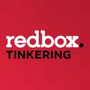

<!-- Improved compatibility of back to top link: See: https://github.com/othneildrew/Best-README-Template/pull/73 -->
<a id="readme-top"></a>
<!--
*** Thanks for checking out the Best-README-Template. If you have a suggestion
*** that would make this better, please fork the repo and create a pull request
*** or simply open an issue with the tag "enhancement".
*** Don't forget to give the project a star!
*** Thanks again! Now go create something AMAZING! :D
-->


<!-- PROJECT SHIELDS -->
<!--
*** I'm using markdown "reference style" links for readability.
*** Reference links are enclosed in brackets [ ] instead of parentheses ( ).
*** See the bottom of this document for the declaration of the reference variables
*** for contributors-url, forks-url, etc. This is an optional, concise syntax you may use.
*** https://www.markdownguide.org/basic-syntax/#reference-style-links
-->


<!-- PROJECT LOGO -->
<br />
<div align="center">
  <a href="https://github.com/zach3697/RedboxDuplicateRemover">
    
  </a>

  <h3 align="center">Redbox Duplicate Remover (Beta)</h3>

  <p align="center">
    A tool meant to remove duplicates in your kiosk!
    <br />
    <!--<a href="https://github.com/othneildrew/Best-README-Template"><strong>Explore the docs »</strong></a>-->
    <br />
    <br />
    <a href="https://github.com/zach3697/RedboxInventoryManager/issues/new?labels=bug">Report Bug</a>
    ·
    <a href="https://github.com/zach3697/RedboxInventoryManager/issues/new?labels=enhancement">Request Feature</a>
  </p>
</div>

<!-- ABOUT THE PROJECT -->
## About The Project

Product Name Screen Shot

A tool meant to remove duplicates in your kiosk! Currently this will keep a single copy of each movie on each type (ie one twister on DVD, one on Blu-Ray, etc). This will be addressed in a future update 

Visit the Discord
https://discord.gg/r9MaZ9ZyWs


<p align="right">(<a href="#readme-top">back to top</a>)</p>


<!-- GETTING STARTED -->
## Getting Started

You can download the source code and start making your own customizations if desiered! Feel free to submit feature requests if there are things you feel should get incorporated. Here is some info about the structure of the application:

* The code was writen in Python 3.8-32 specifically so it could be run on the win7 OS that comes with most kiosk's (Some have been updagraded to windows 10)
* The app.config file contains configuration that the program needs to run

### Prerequisites (Development)

After downloading the files, make sure you have python 3.8-32bit installed and create a virtual environment as follows (Windows):
  ```sh
  python -m venv virt
  ```
Then activate the environment:
  ```sh
  virt/Scripts/activate.ps1
  ```
Once Activated, install the dependencies using the requirements file:
  ```sh
  pip install -r requirements.txt
  ```
  
  You can then run the main application: 
  ```sh
  python main.py
  ```

  If you wish to generate an executable: 
  ```sh
  pip install pyinstaller

  pyinstaller --icon=images/redboxTinkering.ico --name="Duplicate Remover" main.py
  ```

### Prerequisites (Production)

After downloading the files, you can run the main executable directly

### Installation

Just un-zip and run!


<p align="right">(<a href="#readme-top">back to top</a>)</p>


<!-- ROADMAP -->
## Roadmap

- [ ] Allow for duplicate removal type (ie, keep only the highest quality media for each movie)
- [ ] Integrate handling for Bin Clearing
- [ ] Have The code check how many titles are in the bin and tell the user 
- [ ] limit the bin job number of disc to 60 max (based on bin capacity)


See the [open issues](https://github.com/othneildrew/Best-README-Template/issues) for a full list of proposed features (and known issues).

<p align="right">(<a href="#readme-top">back to top</a>)</p>


<!-- CONTRIBUTING -->
## Contributing

Contributions are what make the open source community such an amazing place to learn, inspire, and create. Any contributions you make are **greatly appreciated**.

If you have a suggestion that would make this better, please fork the repo and create a pull request. You can also simply open an issue with the tag "enhancement".
Don't forget to give the project a star! Thanks again!

1. Fork the Project
2. Create your Feature Branch (`git checkout -b feature/AmazingFeature`)
3. Commit your Changes (`git commit -m 'Add some AmazingFeature'`)
4. Push to the Branch (`git push origin feature/AmazingFeature`)
5. Open a Pull Request


<!-- LICENSE -->
## License

Distributed under the MIT License.

<p align="right">(<a href="#readme-top">back to top</a>)</p>


<!-- CONTACT -->
## Contact

Zach Kalb - zachkalb@gmail.com

Project Link: [https://github.com/zach3697/RedboxDuplicateRemover](https://github.com/zach3697/RedboxDuplicateRemover)

<p align="right">(<a href="#readme-top">back to top</a>)</p>


<!-- MARKDOWN LINKS & IMAGES -->
<!-- https://www.markdownguide.org/basic-syntax/#reference-style-links -->
[contributors-shield]: https://img.shields.io/github/contributors/othneildrew/Best-README-Template.svg?style=for-the-badge
[contributors-url]: https://github.com/othneildrew/Best-README-Template/graphs/contributors
[forks-shield]: https://img.shields.io/github/forks/othneildrew/Best-README-Template.svg?style=for-the-badge
[forks-url]: https://github.com/othneildrew/Best-README-Template/network/members
[stars-shield]: https://img.shields.io/github/stars/othneildrew/Best-README-Template.svg?style=for-the-badge
[stars-url]: https://github.com/othneildrew/Best-README-Template/stargazers
[issues-shield]: https://img.shields.io/github/issues/othneildrew/Best-README-Template.svg?style=for-the-badge
[issues-url]: https://github.com/othneildrew/Best-README-Template/issues
[license-shield]: https://img.shields.io/github/license/othneildrew/Best-README-Template.svg?style=for-the-badge
[license-url]: https://github.com/othneildrew/Best-README-Template/blob/master/LICENSE.txt
[linkedin-shield]: https://img.shields.io/badge/-LinkedIn-black.svg?style=for-the-badge&logo=linkedin&colorB=555
[linkedin-url]: https://linkedin.com/in/othneildrew
[product-screenshot]: images/screenshot.png
[Next.js]: https://img.shields.io/badge/next.js-000000?style=for-the-badge&logo=nextdotjs&logoColor=white
[Next-url]: https://nextjs.org/
[React.js]: https://img.shields.io/badge/React-20232A?style=for-the-badge&logo=react&logoColor=61DAFB
[React-url]: https://reactjs.org/
[Vue.js]: https://img.shields.io/badge/Vue.js-35495E?style=for-the-badge&logo=vuedotjs&logoColor=4FC08D
[Vue-url]: https://vuejs.org/
[Angular.io]: https://img.shields.io/badge/Angular-DD0031?style=for-the-badge&logo=angular&logoColor=white
[Angular-url]: https://angular.io/
[Svelte.dev]: https://img.shields.io/badge/Svelte-4A4A55?style=for-the-badge&logo=svelte&logoColor=FF3E00
[Svelte-url]: https://svelte.dev/
[Laravel.com]: https://img.shields.io/badge/Laravel-FF2D20?style=for-the-badge&logo=laravel&logoColor=white
[Laravel-url]: https://laravel.com
[Bootstrap.com]: https://img.shields.io/badge/Bootstrap-563D7C?style=for-the-badge&logo=bootstrap&logoColor=white
[Bootstrap-url]: https://getbootstrap.com
[JQuery.com]: https://img.shields.io/badge/jQuery-0769AD?style=for-the-badge&logo=jquery&logoColor=white
[JQuery-url]: https://jquery.com 

